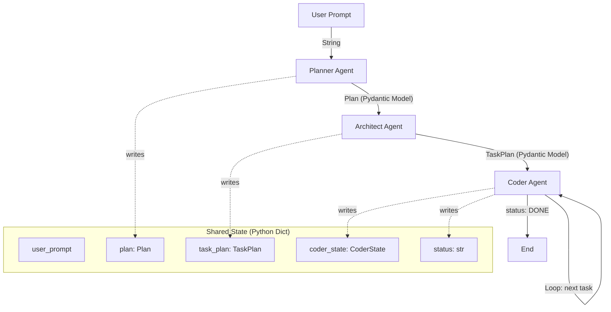

<div align="center">

# 🤖 Bro Code

### *Your AI Dev Team — One Prompt, Entire Projects*

[](https://www.python.org/downloads/)
[](https://github.com/langchain-ai/langgraph)
[](https://groq.com/)
[](LICENSE)

> **Bro Code** is a multi-agent AI coding assistant that takes a single natural-language prompt and autonomously plans, architects, and writes an entire working project — file by file — just like a real engineering team.

[Features](#-features) · [Architecture](#-architecture) · [How It Works](#-how-it-works) · [Getting Started](#-getting-started) · [Examples](#-example-prompts--output) · [Future Scope](#-future-scope)

</div>

---

## 📋 Problem Statement

Building software from scratch is time-consuming, even for experienced developers. You need to decide on file structure, plan the architecture, wire up dependencies, and implement every module — all before shipping a single feature.

**Bro Code eliminates this overhead.** Describe what you want in plain English, and a team of three autonomous AI agents collaborates to deliver a production-ready project scaffold in seconds.

---

## ✨ Features

- 🧠 **Multi-Agent System** — Three specialized AI agents (Planner, Architect, Coder) collaborate through a directed graph pipeline
- 🔄 **Autonomous Pipeline** — End-to-end code generation from natural language with zero human intervention
- 📂 **Real File Output** — Writes actual project files to disk, not just console output
- 🏗️ **Structured Planning** — Pydantic-validated plans & task breakdowns ensure well-organized projects
- 🛡️ **Sandboxed Execution** — All file operations are confined to a `generated_project/` directory for safety
- ⚡ **Blazing-Fast Inference** — Powered by Groq's ultra-low-latency LLM API
- 🔧 **Tool-Using Coder Agent** — Uses LangGraph's ReAct agent with file I/O tools (read, write, list, navigate)
- 🎯 **Dependency-Aware Task Ordering** — Architect ensures files are implemented in the correct order

---

## 🏗️ Architecture

Bro Code uses **LangGraph** to orchestrate a stateful, directed graph of three specialized AI agents:

```
┌──────────────┐      ┌──────────────────┐      ┌──────────────────┐
│              │      │                  │      │                  │
│   Planner    │─────▶│   Architect      │─────▶│   Coder          │
│   Agent      │      │   Agent          │      │   Agent (ReAct)  │
│              │      │                  │      │                  │
└──────────────┘      └──────────────────┘      └────────┬─────────┘
                                                         │    ▲
                                                         │    │
                                                         ▼    │
                                                   ┌──────────────┐
                                                   │  Loop until  │
                                                   │  all tasks   │
                                                   │  complete    │
                                                   └──────────────┘
```

<div align="center">
    
    <br/>
    <em>LangGraph execution flow — auto-generated from the compiled state graph</em>
</div>

### Agent Roles

| Agent | Role | Input | Output |
|-------|------|-------|--------|
| **🗺️ Planner** | Analyzes the user prompt and produces a high-level project plan | User's natural language prompt | `Plan` — app name, description, tech stack, features, and file list |
| **📐 Architect** | Breaks the plan into ordered, dependency-aware engineering tasks | `Plan` object | `TaskPlan` — ordered list of `ImplementationTask` items with file paths and detailed descriptions |
| **💻 Coder** | Implements each task using LangGraph's ReAct agent with file tools | `TaskPlan` + current task index | Actual project files written to disk |

---

## 🔄 How It Works

### Step-by-Step Pipeline

```
User Prompt ──▶ Planner ──▶ Architect ──▶ Coder (loop) ──▶ Complete Project
```

#### Step 1 — Planning
The **Planner Agent** receives the user's natural-language prompt and uses the LLM with **Pydantic structured output** to generate a `Plan` object containing:
- Project name and description
- Technology stack
- List of features
- Files to create (with paths and purposes)

#### Step 2 — Architecture
The **Architect Agent** takes the `Plan` and produces a `TaskPlan` — an ordered list of `ImplementationTask` objects. Each task specifies:
- The exact file path to create or modify
- A detailed description including function signatures, variable names, imports, and integration points
- Tasks are ordered so that dependencies are implemented first

#### Step 3 — Code Generation
The **Coder Agent** iterates through each `ImplementationTask` sequentially using LangGraph's `create_react_agent`. For each task, it:
1. Reads any existing file content to maintain compatibility
2. Generates the implementation using the LLM
3. Writes the file to disk using the `write_file` tool
4. Advances to the next task
5. **Loops back** to itself until all tasks are complete, then terminates

### System Design — How Agents Communicate



**Key Design Decisions:**

- **LangGraph `StateGraph`** manages agent orchestration — each agent is a node, edges define the execution flow
- **Shared state dictionary** is passed between agents; each agent reads from and writes to this shared context
- **Conditional edges** on the Coder node enable a self-loop: the Coder checks if more tasks remain and either loops back or routes to `END`
- **Pydantic models** (`Plan`, `TaskPlan`, `CoderState`) ensure data integrity at every handoff
- **ReAct pattern** for the Coder agent allows it to reason about the task and use tools (read/write files) autonomously
- **Path sandboxing** via `safe_path_for_project()` prevents the AI from writing outside the designated project directory

---

## 🛠️ Tech Stack

| Technology | Purpose |
|-----------|---------|
| **Python 3.11+** | Core language |
| **LangGraph** | Multi-agent orchestration via stateful directed graphs |
| **LangChain** | LLM abstraction layer and tool framework |
| **Groq API** | Ultra-fast LLM inference |
| **Pydantic** | Structured output validation and state management |
| **uv** | Fast Python package & environment management |
| **python-dotenv** | Environment variable management |

---

## 🚀 Getting Started

### Prerequisites

- **Python 3.11+** — [Download here](https://www.python.org/downloads/)
- **uv** (recommended) — [Install uv](https://docs.astral.sh/uv/getting-started/installation/)
- **Groq API Key** — [Get your free API key](https://console.groq.com/keys)

### Installation

```bash
# 1. Clone the repository
git clone https://github.com/krishnab0841/bro_code.git
cd bro_code

# 2. Create and activate a virtual environment
uv venv
# On Windows:
.venv\Scripts\activate
# On macOS/Linux:
source .venv/bin/activate

# 3. Install dependencies
uv pip install -r pyproject.toml

# 4. Set up environment variables
#    Create a .env file in the project root and add:
echo GROQ_API_KEY=your_groq_api_key_here > .env
```

> **Note:** This project uses `pyproject.toml` as the single source of truth for dependencies. A `requirements.txt` is also provided for compatibility with non-uv workflows (`pip install -r requirements.txt`).

### Usage

```bash
# Run the assistant
python main.py

# With a custom recursion limit (default: 100)
python main.py --recursion-limit 150
```

You'll be prompted to enter your project description:

```
Enter your project prompt: Create a modern to-do list app using HTML, CSS, and JavaScript
```

The agents will then plan, architect, and generate your project into the `generated_project/` directory.

---

## 💡 Example Prompts & Output

### Prompt Examples

```
• Create a to-do list application using HTML, CSS, and JavaScript
• Build a simple calculator web application
• Create a blog API in FastAPI with a SQLite database
• Build a weather dashboard using HTML and vanilla JS
• Create a personal portfolio website with dark mode
```

### Example — "Create a to-do app"

**What Bro Code generates:**

```
generated_project/
├── index.html      # Main HTML structure with task input form and list
├── style.css       # Modern, responsive styling with animations
└── app.js          # Full CRUD logic — add, complete, delete tasks
```

**Sample `index.html` snippet:**
```html
<!DOCTYPE html>
<html lang="en">
<head>
    <meta charset="UTF-8">
    <meta name="viewport" content="width=device-width, initial-scale=1.0">
    <title>Modern To-Do App</title>
    <link rel="stylesheet" href="style.css">
</head>
<body>
    <div class="container">
        <h1>📝 My Tasks</h1>
        <div class="input-group">
            <input type="text" id="taskInput" placeholder="Add a new task...">
            <button id="addBtn">Add</button>
        </div>
        <ul id="taskList"></ul>
    </div>
    <script src="app.js"></script>
</body>
</html>
```

**Sample `app.js` snippet:**
```javascript
const taskInput = document.getElementById('taskInput');
const addBtn = document.getElementById('addBtn');
const taskList = document.getElementById('taskList');

addBtn.addEventListener('click', () => {
    const text = taskInput.value.trim();
    if (text) {
        addTask(text);
        taskInput.value = '';
    }
});

function addTask(text) {
    const li = document.createElement('li');
    li.innerHTML = `
        <span class="task-text">${text}</span>
        <div class="task-actions">
            <button class="complete-btn" onclick="toggleComplete(this)">✔</button>
            <button class="delete-btn" onclick="deleteTask(this)">✖</button>
        </div>
    `;
    taskList.appendChild(li);
}
```

---

## 🎬 Demo

<!-- 
Add a GIF or video recording here:
 
-->

> 🚧 **Demo GIF/video coming soon!** Run the project locally to see the agents in action.

---

## ⚠️ Limitations

- **No debugging or testing** — Generated code is not automatically tested or validated
- **Single prompt context** — Agents don't retain memory between runs; each execution starts fresh
- **LLM-dependent quality** — Output quality depends on the underlying model's capabilities
- **No interactive editing** — Cannot iteratively refine generated code through conversation
- **File types** — Best suited for web projects and small-to-medium Python applications
- **Rate limits** — Subject to Groq API rate limits on free-tier accounts

---

## 🔮 Future Scope

| Feature | Description |
|---------|-------------|
| 🧠 **Memory-Enabled Agents** | Persistent memory across sessions using vector stores for context-aware generation |
| 🐛 **Debugging Agent** | A fourth agent that reviews generated code, catches errors, and auto-fixes issues |
| 🧪 **Testing Agent** | Automatically generates and runs unit tests for every generated file |
| 🌐 **Web UI** | Streamlit or Next.js frontend for a visual, interactive experience |
| 📦 **Deployment Agent** | Auto-generates Dockerfiles, CI/CD configs, and deploys to cloud providers |
| 🔁 **Iterative Refinement** | Chat-based follow-up prompts to modify and extend generated projects |
| 📊 **Code Quality Scoring** | Automated linting, complexity analysis, and quality reports for generated code |
| 🗂️ **Template Library** | Pre-built project templates for common patterns (REST API, full-stack app, CLI tool) |

---

## 📝 Resume-Ready Description

Use these bullet points on your resume to showcase this project:

> - **Engineered a multi-agent AI coding assistant** using LangGraph and LangChain that autonomously generates full project scaffolds from natural-language prompts, orchestrating Planner, Architect, and Coder agents through a stateful directed graph pipeline
> - **Designed and implemented a structured agent communication protocol** using Pydantic models for type-safe data flow between agents, with conditional graph edges enabling iterative code generation and sandboxed file I/O for secure execution
> - **Built an end-to-end autonomous code generation system** powered by Groq's LLM API, featuring dependency-aware task ordering, ReAct-pattern tool usage, and path-sandboxed file operations — demonstrating applied expertise in AI agent design, LLM orchestration, and system architecture

---

## 🤝 Contributing

Contributions are welcome! Here's how to get started:

1. **Fork** the repository
2. **Create** your feature branch:
   ```bash
   git checkout -b feature/my-awesome-feature
   ```
3. **Commit** your changes:
   ```bash
   git commit -m "feat: add my awesome feature"
   ```
4. **Push** to the branch:
   ```bash
   git push origin feature/my-awesome-feature
   ```
5. **Open** a Pull Request

### Areas to Contribute

- 🐛 Bug fixes and error handling improvements
- 📝 Documentation and example prompts
- 🧪 Adding a testing/debugging agent
- 🎨 Building a web UI frontend
- 🔧 Supporting additional LLM providers

---

## 📁 Project Structure

```
bro_code/
├── main.py                  # CLI entry point — accepts prompts and invokes the agent graph
├── agent/
│   ├── __init__.py
│   ├── graph.py             # LangGraph state graph — defines agents, nodes, edges, and compilation
│   ├── prompts.py           # System & user prompt templates for each agent
│   ├── states.py            # Pydantic models — Plan, TaskPlan, ImplementationTask, CoderState
│   └── tools.py             # LangChain tools — file read/write, directory listing, path sandboxing
├── generated_project/       # Output directory — all AI-generated project files go here
├── resources/
│   └── coder_buddy_diagram.png  # Architecture diagram
├── pyproject.toml           # Project metadata and dependencies (primary)
├── requirements.txt         # Dependency list (pip compatibility fallback)
├── .env                     # Environment variables (GROQ_API_KEY) — not committed
└── .gitignore
```

---

## 📄 License

This project is licensed under the **MIT License** — see the [LICENSE](LICENSE) file for details.

---

<div align="center">

**Built with ❤️ by [Krishna Bulbule](https://github.com/krishnab0841)**

*If you found this project helpful, give it a ⭐ on GitHub!*

</div>